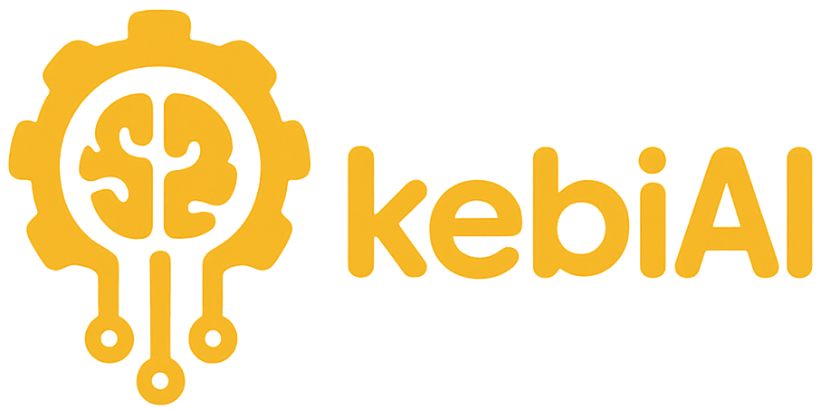

# Kebi AI Website

Official marketing website for **Kebi AI LLC**, showcasing **Vehix** - our AI-powered vehicle recall management platform for automotive dealerships.



## About

Kebi AI builds innovative SaaS solutions for the automotive industry, powered by advanced data analytics and artificial intelligence. We transform complex operational challenges into intelligent, automated systems that drive efficiency and growth.

**Vehix**, our flagship product, helps automotive dealerships manage vehicle safety recalls efficiently with:
- Geographic visualization of recalls across dealer networks
- AI-powered routing and technician assignment
- Real-time tracking and performance metrics
- Multi-tenant dealership management
- Campaign configuration and prioritization

**Target Market:** Automotive dealerships, dealer networks, service directors, and fleet managers

## Tech Stack

This website is built with modern web technologies for optimal performance and developer experience:

### Core
- **React 18.3.1** - UI library with hooks
- **TypeScript 5.8.3** - Type-safe JavaScript
- **Vite 5.4.19** - Fast build tool and dev server
- **React Router DOM 6.30.1** - Client-side routing

### UI & Styling
- **Tailwind CSS 3.4.17** - Utility-first CSS framework
- **shadcn/ui** - High-quality component library (50+ components)
- **Radix UI** - Accessible component primitives
- **Lucide React** - Beautiful icon library

### Forms & Data
- **React Hook Form 7.61.1** - Performant form handling
- **Zod 3.25.76** - Schema validation
- **TanStack Query 5.83.0** - Async state management

### Additional
- **Embla Carousel** - Smooth carousels
- **Recharts** - Data visualization
- **Sonner** - Toast notifications
- **next-themes** - Dark mode support

## Quick Start

### Prerequisites
- Node.js 18+
- npm or bun

### Installation

1. **Clone the repository:**
```bash
git clone <YOUR_GIT_URL>
cd kebiai-website
```

2. **Install dependencies:**
```bash
npm install
```

3. **Start development server:**
```bash
npm run dev
```

4. **Open browser:**
Navigate to `http://localhost:8080`

## Available Scripts

```bash
# Development
npm run dev          # Start dev server on port 8080

# Build
npm run build        # Production build
npm run build:dev    # Development build with source maps

# Quality
npm run lint         # Lint code with ESLint

# Preview
npm run preview      # Preview production build locally
```

## Project Structure

```
kebiai-website/
├── public/                  # Static assets
│   ├── favicon.ico
│   ├── placeholder.svg
│   └── robots.txt
│
├── src/
│   ├── assets/             # Images and media
│   ├── components/         # React components
│   │   ├── ui/            # shadcn/ui components (50+)
│   │   ├── Navigation.tsx
│   │   ├── Hero.tsx
│   │   ├── Features.tsx
│   │   └── ...
│   ├── hooks/             # Custom React hooks
│   ├── lib/               # Utilities
│   ├── pages/             # Page components
│   │   ├── Index.tsx     # Homepage
│   │   └── NotFound.tsx  # 404 page
│   ├── App.tsx            # Root component
│   ├── main.tsx           # Entry point
│   └── index.css          # Global styles
│
├── components.json         # shadcn/ui config
├── tailwind.config.ts      # Tailwind configuration
├── vite.config.ts          # Vite configuration
├── website-design-brief.md # Complete design specification
├── CLAUDE.md               # Developer/AI assistant guide
└── README.md               # This file
```

## Design System

### Brand Colors

- **Golden Amber** (`#E8B02D`) - Primary CTAs, accents, highlights
- **Deep Black** (`#1A1A1A`) - Text, headers, dark sections
- **Deep Blue** (`#2563EB`) - Secondary CTAs, trust indicators
- Light Gray (`#F8F9FA`) - Backgrounds
- White (`#FFFFFF`) - Primary background

### Typography

- **Body Text:** Inter (loaded from Google Fonts)
- **Headlines:** Poppins (loaded from Google Fonts)
- Responsive font sizes with mobile-first approach

### Components

This project uses [shadcn/ui](https://ui.shadcn.com/), a collection of accessible, customizable components built with Radix UI and Tailwind CSS.

**Adding new components:**
```bash
npx shadcn@latest add [component-name]
```

## Development

### Adding New Pages

1. Create page component in `src/pages/`:
```tsx
export default function NewPage() {
  return <div>Content</div>;
}
```

2. Add route in `src/App.tsx`:
```tsx
<Route path="/new-page" element={<NewPage />} />
```

3. Update navigation in `src/components/Navigation.tsx`

### Styling Guidelines

- Use Tailwind utility classes
- Follow mobile-first responsive design
- Use `cn()` utility from `@/lib/utils` for conditional classes
- Use CSS variables for colors: `bg-primary`, `text-foreground`, etc.

### Code Style

- **Components:** PascalCase (e.g., `HeroSection.tsx`)
- **Utilities:** kebab-case (e.g., `use-mobile.tsx`)
- Use TypeScript for type safety
- Prefer functional components with hooks
- One component per file

## Current Implementation

### Pages
- **Homepage (/)** - Fully implemented single-page marketing site with 9 sections
  - Hero with CTAs and social proof
  - Problem statement (3 pain points)
  - Features (6 key features with alternating layout)
  - How it works (4-step process)
  - Benefits (6 measurable outcomes)
  - Future products teaser
  - Final CTA section
  - Footer with navigation
- **404 Page** - Simple error page

### Features
- Responsive navigation with mobile menu
- Smooth scroll animations
- Interactive hover states
- Dark mode support (infrastructure ready)
- Accessible components (WCAG 2.1 AA)
- SEO optimized meta tags

### Mobile Responsiveness

**Mobile Responsiveness Score: 9.0/10**

The website is fully optimized for mobile devices with a mobile-first responsive design approach:

**Key Mobile Features:**
- All touch targets meet 44x44px minimum guideline (Apple HIG, Material Design)
- Mobile navigation with 48x48px tap target for menu toggle
- Mobile nav links with 48px touch areas
- Progressive responsive typography (text scales from mobile to desktop)
- Optimized section padding for small screens
- Lazy loading for images to improve mobile performance

**Responsive Typography:**
- Hero headline: `text-4xl` (mobile) → `text-7xl` (large desktop)
- Tagline: `text-xs` (mobile) → `text-sm` (tablet+)
- Section headings scale progressively across breakpoints

**Tested Devices:**
- iPhone SE (375px)
- iPhone 12/13/14 (390px)
- iPhone 14 Pro Max (430px)
- iPad Mini (768px)
- iPad Pro (1024px)
- Desktop (1280px+)

**Breakpoints:**
- `sm`: 640px
- `md`: 768px
- `lg`: 1024px
- `xl`: 1280px

## Roadmap

### Next Steps

**Pages to Add:**
- [ ] `/features` - Detailed product information
- [ ] `/pricing` - Pricing tiers and plans
- [ ] `/about` - Company story, team, vision
- [ ] `/contact` - Contact form
- [ ] `/privacy`, `/terms`, `/security` - Legal pages

**Functionality:**
- [ ] Implement functional forms (demo request, contact)
- [ ] Add analytics tracking (Google Analytics, etc.)
- [ ] Email integration for form submissions
- [ ] Newsletter signup
- [ ] Demo video modal
- [ ] Testimonials/case studies section

**Enhancements:**
- [ ] Blog/resources section
- [ ] Customer logo social proof band
- [ ] Live chat widget integration
- [ ] Performance optimization (image formats, lazy loading)
- [ ] SEO enhancements (structured data, sitemap)

## Documentation

- **[CLAUDE.md](CLAUDE.md)** - Comprehensive developer guide for AI assistants and developers
- **[website-design-brief.md](website-design-brief.md)** - Complete design specification (710 lines)
  - Brand identity guidelines
  - All page wireframes
  - Content strategy
  - Multi-product vision

## SEO & Performance

### SEO Features
- Semantic HTML structure
- Meta tags for title and description
- Open Graph tags for social sharing
- Twitter card tags
- Responsive design
- Fast loading times with Vite

### Performance Optimizations
- Vite for fast builds and HMR
- SWC compiler for React Fast Refresh
- Code splitting with React Router
- Optimized asset loading
- CSS purging with Tailwind

## Browser Support

- Chrome (latest)
- Firefox (latest)
- Safari (latest)
- Edge (latest)
- Mobile browsers (iOS Safari, Chrome Mobile)

## Accessibility

This website follows WCAG 2.1 AA guidelines:
- Semantic HTML
- Sufficient color contrast (4.5:1 for text)
- Keyboard navigation support
- ARIA labels on interactive elements
- Alt text for images
- Focus indicators

## Development & Deployment

### Local Development

**Requirements:** Node.js 20+ & npm - [install with nvm](https://github.com/nvm-sh/nvm#installing-and-updating)

```bash
# Clone the repository
git clone git@github.com:kebi-ai/kebiai-website.git

# Navigate to project directory
cd kebiai-website

# Install dependencies
npm install

# Start development server
npm run dev
```

Visit `http://localhost:8080` to view the site.

### Edit on GitHub

- **Direct Edit**: Navigate to files, click "Edit" button (pencil icon), make changes and commit
- **GitHub Codespaces**: Click "Code" → "Codespaces" → "New codespace" to launch a cloud IDE

### Deploy

**Automatic Deployment:**
The site automatically deploys to [https://kebi.ai](https://kebi.ai) via GitHub Actions on every push to the `main` branch.

**Manual Build:**
```bash
npm run build
```
Build output will be in the `dist/` directory.

## Contributing

### Code Quality
- Run `npm run lint` before committing
- Follow existing code patterns
- Write clear, descriptive commit messages
- Test responsive design on multiple devices
- Ensure accessibility standards are met

### Component Guidelines
- Use shadcn/ui components when possible
- Follow established styling patterns
- Keep components focused and reusable
- Add TypeScript types for props
- Document complex logic with comments

## Environment Variables

Currently, no environment variables are required. When adding API integrations or analytics, create a `.env` file:

```env
VITE_API_URL=your_api_url
VITE_GA_ID=your_google_analytics_id
```

Access in code:
```typescript
const apiUrl = import.meta.env.VITE_API_URL;
```

## Troubleshooting

### Common Issues

**Port 8080 already in use:**
```bash
# Kill process on port 8080 (macOS/Linux)
lsof -ti:8080 | xargs kill -9
```

**Dependencies not installing:**
```bash
# Clear npm cache
npm cache clean --force
rm -rf node_modules package-lock.json
npm install
```

**Build errors:**
```bash
# Check for TypeScript errors
npm run lint
# Clear Vite cache
rm -rf node_modules/.vite
```

## Resources

- [React Documentation](https://react.dev/)
- [TypeScript Documentation](https://www.typescriptlang.org/)
- [Vite Documentation](https://vite.dev/)
- [Tailwind CSS Documentation](https://tailwindcss.com/)
- [shadcn/ui Documentation](https://ui.shadcn.com/)
- [Radix UI Documentation](https://www.radix-ui.com/)

## License

Copyright 2025 Kebi AI LLC. All rights reserved.

## Contact

**Kebi AI LLC**

For business inquiries: [Contact information to be added]

For technical issues: See GitHub issues

---

Built with React, TypeScript, and Vite
Designed for automotive dealerships who want to streamline recall management

**Version:** 1.0.0
**Last Updated:** October 30, 2025
